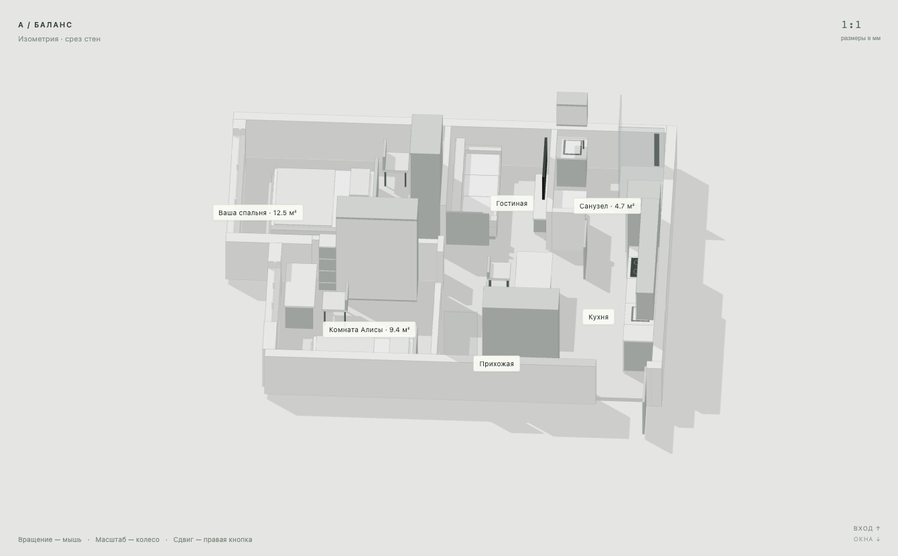

# Планировка Лизы · Лесная Поляна

[Открыть 3D-квартиру](https://mynameisnastasya.github.io/apartment-master/) · [План и решения](https://mynameisnastasya.github.io/apartment-master/LIZA.html)

Основной вариант **D — «Лиза · доработанный»** сохраняет расположение из референса. Исправлены независимые входы в комнаты, проход у прихожей (960 мм), переход к кухне (910 мм), повёрнутые кровати, доступ к шкафу, размещение дивана напротив ТВ и реальные места за столом. Спальня около 11,24 м²; размеры пересчитаны по существующей условной коробке. Локальное сужение за диваном и компактная обеденная зона описаны в отчёте.

Палитра: тёплый белый, светлый дуб, шалфей и песочный текстиль. Дизайн эскизный. Обмер, инженерия, окна и возможность перепланировки требуют проверки.

```sh
npm ci
npm run qa
npm run build
npm start
```

Сборка обновляет `index.html`, `LIZA.html`, `views/D-floor-plan.svg` и `MASTER-APARTMENT.json`. Новая проверка `scripts/reference-qa.mjs` учитывает повёрнутые тела, 12 маршрутов, независимость комнат, открывание приборов и мебель в секторе дверей. Это проверка геометрии, не универсального комфорта. Результат: `reference-qa-results.json`.

`LIZA.html` — актуальные решения и план. `REPORT.html`, старые GLB и виды A/B/C — архив. Актуальный GLB варианта D экспортируется кнопкой в просмотрщике. Встроенный JSON содержит все четыре варианта.

---

## Архивная документация исходных A/B/C

# Модель квартиры · Лесная Поляна

**Общедоступный сайт: https://mynameisnastasya.github.io/apartment-master/**

[Открыть 3D-модель](https://mynameisnastasya.github.io/apartment-master/) · [Отчёт и альбом](https://mynameisnastasya.github.io/apartment-master/REPORT.html)

Откройте **index.html** в Chrome, Safari или Edge. Модель работает без сервера и без интернета: Three.js и данные включены в HTML. Полный отчёт с альбомом — **REPORT.html**.

На GitHub откройте **Code → Download ZIP**, распакуйте проект и откройте `index.html` в браузере. GitHub показывает исходный HTML, а сам просмотрщик запускается локально.



Для локального сервера выполните `npm start` и откройте http://127.0.0.1:4173.

## Управление

- A / B / C слева — три варианта. A рекомендован, но ещё не утверждён вами.
- Изометрия / Вращение: левая кнопка вращает, колесо меняет масштаб, правая кнопка сдвигает.
- План — ортографическая проекция. Сверху — верхняя перспектива.
- Прогулка: WASD или стрелки; удерживайте кнопку мыши и двигайте её для обзора. Двойной клик запрашивает захват мыши, если браузер его разрешает; Esc отпускает. Drag-обзор работает без захвата.
- Высота взрослого 1700 мм, Алисы 1200 мм. Скорость 1,15 м/с, тело для коллизий диаметром 500 мм.
- Кнопки комнат переходят к заданным ракурсам или точкам внутри комнаты.
- «Сравнение и маршруты» запускает автоматическую прогулку. WASD или Esc её прерывают.
- Клик по мебели показывает габариты. Для техники кнопка в карточке показывает условную открытую дверцу и добавляет её к препятствиям.
- Слои управляют мебелью, стенами, срезом, размерами, подписями и резервами открывания.
- PNG сохраняет ракурс. GLB экспортирует полные стены и мебель текущего варианта, даже если на экране включён срез. В «О проекте» есть экспорт JSON.

## Файлы

- `index.html` — автономный интерактивный просмотрщик.
- `REPORT.html`, `REPORT.md` — отчёт, сравнение, размеры, ограничения и альбом.
- `geometry-notes.md` — разбор неоднозначных размерных цепочек.
- `MASTER-APARTMENT.json` — вся редактируемая модель в мм, все варианты, исходные допущения.
- `MASTER-A.glb`, `MASTER-B.glb`, `MASTER-C.glb` — переносимая геометрия в метрах для других 3D-программ.
- `BASE-SHELL.glb` — исходная коробка без предложенных перегородок и мебели.
- `views/` — планы SVG, изометрии, перспективы, комнаты и взрослый/детский обзор.
- `reference/` — копия исходного обмерного изображения.
- `src/data/geometry.json` — постоянная геометрия и исходные размеры.
- `src/data/layouts.json` — предложенные перегородки, мебель, двери, зазоры, маршруты.
- `src/data/project.json` — этап, выбранный кандидат и статус ожидания утверждения.
- `src/scene/` — геометрические примитивы, отдельные материалы и техническое освещение.
- `src/interaction/` — камеры, столкновения, поиск маршрутов, открытые приборы.
- `qa-results.json`, `appliance-qa-results.json`, `browser-qa-results.json` — воспроизводимые результаты проверки с указанными границами применимости.

## Продолжение разработки

Требуется Node.js. В папке проекта:

```sh
npm ci
npm run build
npm start
```

Для повторной проверки данных и условных открытых приборов:

```sh
npm run qa
node scripts/appliance-qa.mjs
```

Сборка повторно создаёт автономный `index.html`. После изменения данных запустите `node scripts/plans.mjs` для обновления SVG-планов. Браузерная QA использует установленный Chrome на macOS; путь указан в `scripts/browser-qa.mjs`.

Изменение координат и габаритов выполняется в JSON. Например, сдвиг шкафа на 150 мм — изменение `x` или `y` соответствующего объекта. Единый перевод в сцену находится в `src/data/model.js`: `mm(value) = value / 1000`. `width/depth` — габариты по x/y, `front` — направление фасада. Все текущие тела ортогональны; произвольные повороты потребуют расширения коллизий, а не только поля `rotation`.

Материалы отделены от геометрии. Для реальной мебели можно заменить функцию её отображения моделью GLB, сохранив стабильный id и габарит для коллизий. Декор пока пуст. Перед следующим этапом сохраняйте те же id и файл геометрии; не восстанавливайте квартиру заново.

## Статус исходных данных

Это **условная геометрия**, а не подтверждённый обмер. Ширина 6400 мм читается уверенно. Вертикали, два оконных узла, вход, высоты и инженерные коммуникации требуют уточнения. Все спорные величины сохранены в допущениях. Вариант A — рекомендованный кандидат, не утверждённая рабочая документация.
